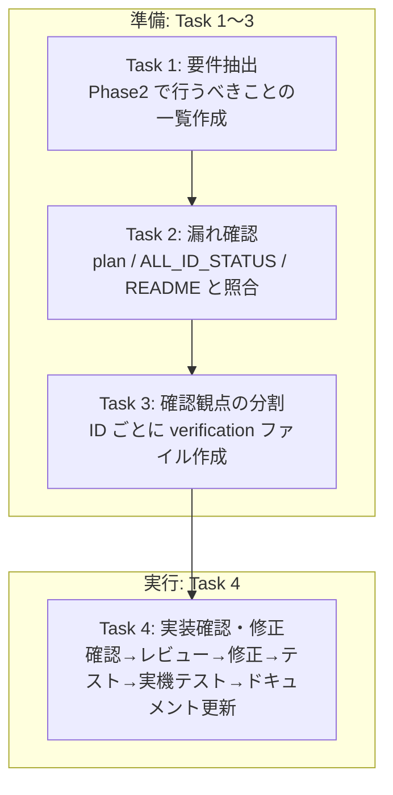
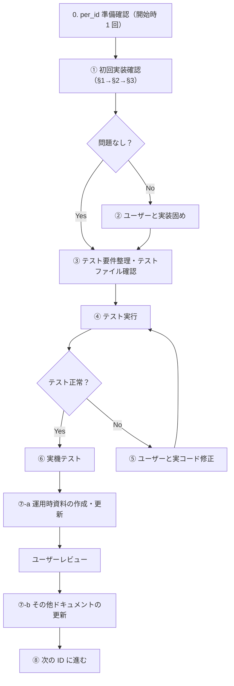

# Phase2 検証タスク順序

検証を段階的に進めるためのタスクと順序を定義する。

**前提**: Task 1〜3 は Task 4（実装の確認・修正）を行う前の**準備**である。Task 4 で実際の確認・修正・テストを実施する。

---

## 進め方の全体像

---

## Task 1: Phase2 要件の一覧作成

**目的**: Phase0A/0B/1 の決定事項・設計に基づき、Phase2 で行うべきことの網羅的な一覧を作成する。（Task 4 の準備）

**対象**: `docs/config_migration` 内の phase2 以外のファイル

| ファイル | 確認内容 |
|----------|----------|
| ルート（CHANGE_LOG, DECISION_LOG 等） | Phase2 スコープ・制約 |
| phase0A / phase0B | To-Be SSoT、廃止計画、参照マップ |
| phase1 | フォールバック方針、スキーマ、ロールバック |
| 他フェーズ README | Phase2 の前提・境界 |

**成果物**: `phase2/PHASE2_REQUIREMENTS_LIST.md`（Phase2 で行うべきことの一覧）

---

## Task 2: 漏れ確認

**目的**: Task 1 の一覧と plan / ALL_ID_STATUS / README を照合し、要件の漏れを洗い出す。（Task 4 の準備）

**照合対象**:
- `@.cursor/plans/phase2_全量移行計画_*.plan.md`
- `phase2/ALL_ID_STATUS.md`
- `phase2/README.md`

**成果物**: `phase2/REQUIREMENTS_GAP_CHECK.md`（漏れ確認結果、差分・補足事項を記録）

---

## Task 3: 確認観点の分割

**目的**: 実装確認を実施するために、**ID ごと**に確認観点を記載した verification ファイルを作成する。（Task 4 の準備）

**分割方針**: plan のバッチ（B, A1, A2, A3, C/D）に含まれる各 **ID 単位**で verification ファイルを作成する。各ファイルに以下を記載:

- Task 2 で抽出した残タスク（該当するもの）
- plan / ALL_ID_STATUS / README から抽出した確認観点
- 実装済み内容のサマリ（変更ファイル・変更概要）
- 「テスト側に問題があると断定できない項目」のうち、該当する実装領域に紐づくもの

**成果物（ID ごとの verification ファイル）**:

| バッチ | 対象 ID | ファイル名 |
|--------|---------|------------|
| B | D-05 | `D05_settlementAggregator.md` |
| B | D-07 | `D07_dualWrite.md` |
| B | D-08 | `D08_enqueueScheduler.md` |
| B | D-09 | `D09_templateBusinessDateCheck.md` |
| B | B-06 | `B06_tableDeviceRegistration.md` |
| A1 | CALC_BUFFER | `CALC_BUFFER.md` |
| A1 | D-10 | `D10_autoOpenClose.md` |
| A1 | R-10 | `R10_businessHoursStyles.md` |
| A1 | D-04 | `D04_linePlan.md` |
| A1 | R-09 | `R09_requiredStaffByTimeSlot.md` |
| A1 | R-11/R-12 | `R11_R12_billing.md` |
| A2 | R-06 | `R06_entranceFee.md` |
| A2 | R-07 | `R07_payroll.md` |
| A2 | R-08 | `R08_shiftFlow.md` |
| A2 | R-09 | `R09_requiredStaffByTimeSlot_flutter.md`（または R09 に統合可） |
| A2 | R-10 | `R10_businessHoursStyles_flutter.md`（または R10 に統合可） |
| A2 | R-11/R-12 | `R11_R12_billing_flutter.md`（または R11_R12 に統合可） |
| A2 | D-04 | `D04_linePlan_flutter.md`（または D04 に統合可） |
| A3 | config.js | `A3_configJs.md` |
| A3 | globalConstant | `A3_globalConstantCleanup.md` |
| C/D | 状態記録 | `CD_stateRecording.md` |

※ Functions と Flutter で同じ ID を扱う場合は、1 ファイルに両方の確認観点を記載するか、別ファイルに分けるかは Task 3 実施時に判断する。

**Task 3 で必ず含めること**: 下記「テスト側に問題があると断定できない項目」を、該当する実装領域に応じて各 ID の verification ファイルに記載する。該当 ID が明確でない場合は `UNKNOWN_impl_verification.md` 等の共通ファイルにまとめる。いずれにせよ、Task 4 で「これらのテスト失敗が実装に原因があるのではないか」という観点で必ず確認を行う。

---

## テスト側に問題があると断定できない項目

以下のテストは、失敗原因がテストの前提・期待値の古さなのか実装の不備なのか断定できない。**Task 3 で該当 ID の verification ファイルに適切に記載し、Task 4 で実装に原因がある可能性を必ず確認し、必要であれば修正すること。**

### 1. Firestore へ undefined を書き込んでいる（eventBusinessDate / businessDate）

| テストファイル | エラー内容 | 該当 ID の目安 |
|----------------|------------|----------------|
| postEventRefund.spec.ts, postEventReopen.spec.ts, postEventAdjustment.spec.ts, postEventCancel.spec.ts | `eventBusinessDate` が undefined | 営業日取得・bills 関連 |
| cancel_restore_startAt.spec.ts | `businessDate` が undefined（updateScheduledTournamentStartAt） | トーナメント・営業日 |
| step1_emulator_verification.spec.ts | `businessDate` が undefined（createScheduledTournament 等） | トーナメント・営業日 |

**確認観点（Task 4）**: 営業日を取得している箇所で undefined のときに Firestore に書かない（またはエラーで返す）ようになっているか。

---

### 2. applyCloseSnapshot の結果が空（updatedBillIds）

| テストファイル | 該当 ID の目安 |
|----------------|----------------|
| step3.spec.ts, phase6_5_store_management_permission.spec.ts | close 処理・営業日 |

**確認観点（Task 4）**: applyCloseSnapshot が Phase2 の営業日・config 参照と整合しているか。

---

### 3. appendItem のエラーコードの不一致

| テストファイル | 該当 ID の目安 |
|----------------|----------------|
| appendItem.spec.ts | R-11/R-12（会計） |

**確認観点（Task 4）**: status が settled / settling の場合の HttpsError code が仕様と一致しているか。

---

### 4. 集計結果のプロパティ参照エラー（aggregator）

| テストファイル | 該当 ID の目安 |
|----------------|----------------|
| aggregator.spec.ts | R-11/R-12（会計） |

**確認観点（Task 4）**: 集計結果が `grossIncl` 等の想定プロパティを返す形になっているか。

---

## Task 4: 実装の確認・修正

**目的**: Task 3 で作成した各 verification ファイル（per_id 内）を用いて、実装を 1 件ずつ確認し、問題があれば修正する。加えて、実機テストで確認すべき項目を実行する。

**関連ファイル**:
- `per_id_TASK4_PROCEDURE.md` … 詳細な進め方（本セクションの詳細版）
- `per_id_PROGRESS.md` … 進捗記録（各 ID のステータス・メモ・初回実装確認サマリ）
- `per_id_CHANGE_LOG.md` … 修正を行った際の詳細ログ

### 進め方の前提

**各 per_id ごとに ①→⑧ を順に実施する。** 1 つの ID を完了してから次の ID に進む。

### Task 4 の進め方（概要）

| ステップ | 内容 | 補足 |
|----------|------|------|
| **0** | per_id 準備確認 | Task 4 開始時に 1 回のみ。CHECKLIST / GAP_CHECK / VERIFICATION_TASK_ORDER を参照し、各 per_id の §1〜§3 が適切か確認。不備あれば per_id を修正 |
| **①** | 初回実装確認 | per_id の §1→§2→§3 を順に確認。コード修正はせず、実装確認結果欄に出力。per_id_PROGRESS に反映 |
| **②** | 実装固め | ① で問題ありの場合のみ。ユーザーと実装を固める。ログはテスト完了後に記載 |
| **③** | テスト要件整理・テストファイルの確認・修正 | テスト要件整理（Cursor/テストファイル/実機の3区分）、既存テストの確認・新規作成。完了後、chat でサマリを平易にまとめる |
| **④** | テストの実行 | テストファイルを実行。失敗時は期待値・前提の古さか実装不備かを切り分け。前者ならテスト修正、後者なら ⑤ へ |
| **⑤** | 実コードの修正 | ④ で実装原因の失敗があった場合のみ。ユーザーと並走。修正は per_id_CHANGE_LOG に記載 |
| **⑥** | 実機テストの実施 | ユーザーが実施。問題ごとにユーザーと修正。修正は per_id_CHANGE_LOG に記載 |
| **⑦-a** | 運用時資料の作成・更新 | docs/運用時資料/設定/storeMeta/configによる設定の詳細/ 内の該当ファイルを作成・更新。**ユーザーレビュー** |
| **⑦-b** | その他ドキュメントの更新 | レビュー完了後。per_id 内の取得失敗時挙動・切り戻し手順、per_id_PROGRESS、per_id_CHANGE_LOG、tobe_config_architecture（Z 該当時）を更新 |
| **⑧** | 次の ID に進む | 次の per_id ファイルに進む |

※ ② を skip にするのは、① の §1・§2・§3 **全て**問題なしの場合のみ。§2 の「問題なし」は実装漏れが何もない状態（確定した漏れが未解消の場合は問題あり）。④ が正常なら ⑤ は skip。**Z_crossCutting**: 全 ID の ⑦ 完了後に一度だけ確認する。詳細は `per_id_TASK4_PROCEDURE.md` を参照。

### 実機テストで確認すべき項目

| 区分 | 確認項目 | 確認方法 |
|------|----------|----------|
| **設定反映** | storeMeta/config の変更がアプリに反映されるか | 設定詳細ページで値を変更 → アプリを再起動 or 画面遷移 → 反映を確認 |
| **入店料（R-06）** | 入店料・説明文・再入店時課金が config に従うか | チェックイン画面で入店料表示、再入店時の課金有無を確認 |
| **シフト（R-08）** | 提出期間・組む期間の表示が config に従うか | シフト画面で日付範囲が正しいか確認 |
| **給与（R-07）** | 給与期間の表示が config に従うか | 勤怠管理画面で締め日が正しいか確認 |
| **営業時間（R-10）** | 営業日編集でスタイル一覧が config に従うか | 営業日編集画面で weekday / weekendHoliday 等が正しく表示されるか |
| **会計（R-11/R-12）** | チップレート・ポイント優先順位・支払い方法が config に従うか | 会計画面でチップ円換算、ポイント使用順、支払い方法選択肢を確認 |
| **LINE（D-04）** | linePlan に応じたシフト辞退等の動作 | LINE 連携がある場合、プラン種別に応じた機能の有無を確認 |
| **自動開閉店（D-10）** | 自動開閉店が config に従って動作するか | ジョブ実行環境で enabled / offset が期待どおりか確認（可能であれば） |

※ 実行テストはユーザーが実施する。結果は各 ID の verification ファイルに記録する。

### 進め方（フロー図）

詳細は `per_id_TASK4_PROCEDURE.md` を参照すること。

### 成果物

- 各 per_id  verification ファイルの更新（確認結果・取得失敗時挙動・切り戻し手順・テスト要件整理・テストファイル確認・テスト結果・実機テスト結果の記入）
- `per_id_PROGRESS.md` の更新（進捗・初回実装確認サマリ）
- `per_id_CHANGE_LOG.md` の更新（修正を行った場合）
- 必要に応じた実コードの修正
- 必要に応じたテストファイルの修正
- `docs/運用時資料/設定/storeMeta/configによる設定の詳細/` 内の各設定説明ファイルの完成
- `tobe_config_architecture.md` の更新（Z_crossCutting 該当時。GAP-2-3 修正）

---

## 補足

- **Task 1〜3 の位置づけ**: いずれも Task 4 を行う前の準備。要件の洗い出し・漏れ確認・確認観点の整理であり、実装の確認・修正は Task 4 で行う。
- **テスト失敗の切り分け**: テスト側の修正（型・seed・パス等）は本タスク順序の対象外。ただし「テスト側に問題があると断定できない項目」は Task 3 で分割先に記載し、Task 4 で実装原因の有無を確認し、必要であれば実装を修正する。テストファイル側に問題がある場合（Task 4 の 7 で判明した場合）は修正する。
- **実装修正の方針**: 計画に沿った誤りは修正。計画外の追加仕様は DECISION_LOG 等で判断を記録した上で扱う。
