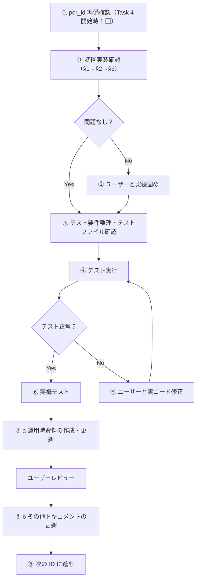

# per_id Task 4 進め方

per_id 内の各ファイルを用いて実装確認を行う際の、詳細な進め方を記載する。

**関連ファイル**:
- `per_id_PROGRESS.md` … 進捗を記録する（各 ID のステータス・メモ）
- `per_id_CHANGE_LOG.md` … 修正を行った際の詳細ログを残す
- `docs/運用時資料/設定/取得失敗時の挙動設計.md` … GAP-2-1 の蓄積先（設定ごと）
- `docs/運用時資料/設定/設定の不具合時の対応.md` … GAP-2-2 の蓄積先（設定ごと）

---

## GAP-2-1 / GAP-2-2 の扱い

以下の 2 項目は**全設定で共通**の未実装ポイントであり、同じ進め方とする。

| 項目 | 蓄積先 | 発覚タイミング | ② での対応 | 実装・ドキュメントのタイミング |
|------|--------|----------------|------------|--------------------------------|
| GAP-2-1 取得失敗時の挙動設計 | `docs/運用時資料/設定/取得失敗時の挙動設計.md` | ① で発覚（ほぼ全 ID） | **行わない** | ⑦-a 完了後、ユーザーにどうするか尋ね、決めてから実施 |
| GAP-2-2 設定の不具合時の対応 | `docs/運用時資料/設定/設定の不具合時の対応.md` | ① で発覚（ほぼ全 ID） | **行わない** | ⑦-a 完了後、ユーザーにどうするか尋ね、決めてから実施 |

**重要**: ① で GAP-2-1, 2-2 のみが「問題あり」として発覚した場合（他は問題なし）は、② を飛ばして③ に進む。⑦-a のユーザーレビュー完了時点でユーザーに方針を確認し、決定後に実装とドキュメント追加・修正を行う。

---

### 2-1 取得失敗時の仕様・デフォルト対応

**ケースの切り分け**:

| ケース | 内容 | 必須対応 |
|--------|------|----------|
| **読めるがフィールドが存在しない** | ドキュメントは取得できるが、当該設定のフィールドが存在しない | **必ずデフォルト値を適用する** |
| **読めない（Firestore 障害等）** | Firestore の読み取りに失敗した（リトライ後も失敗） | 下記 2 択から設定ごとに選択 |

**デフォルト方針（2 択）**: 各設定の検証時に、本デフォルトとするか**別仕様**とするかをユーザーが指示する（設定によっては異なる仕様とすることがある）。

| 方針 | 内容 |
|------|------|
| **A. デフォルトを正とする** | デフォルト値を正としてデフォルトの処理を行う |
| **B. ユーザーに選択させる** | 画面にエラーを表示し、どういう処理かユーザーに選択させる。保守側が検知できるようエラーコードを出す |

---

### 2-2 設定の不具合時の仕様・デフォルト対応

**不具合のケース分類（A〜D）**:

| ケース | 内容 | 主な対応 |
|--------|------|----------|
| **A. 設定値の誤り** | 管理者が誤った値を設定した | Firestore の値を修正 |
| **B. 運用ミス** | テスト用設定を本番に適用した、設定変更を取り消したい | Firestore の値を修正 |
| **C. コードのバグ** | 特定の設定値で実装にバグがあり不具合が発生 | コード修正・デプロイ、またはロールバック |
| **D. コードと設定の不整合** | デプロイ済みコードと config のスキーマ・想定が合っていない | 設定 or コードのどちらかを修正 |
| **E. Firestore 障害** | Firestore が利用不可で config を読めない | 「取得失敗時の挙動設計」（2-1）の範疇。本項目の対象外 |

**デフォルトの対応方針**: A〜D は**統一した処理を基本**とする（例外設定あり得る）。各設定の検証時に、本デフォルトとするか別仕様とするかをユーザーが指示する。

**D-05（settlementAggregatorEnabled）の特例仕様**（原則と異なる）:

| ステップ | 処理 |
|----------|------|
| 1 | **リトライを必ず行う** |
| 2 | **A, B**: デフォルト値で処理を実行し、エラーコードを出力 |
| 2 | **C, D**: デフォルトで無理やり実行できる場合は実行＋エラーコード。それ以外は処理をスキップし、エラーコード出力＋画面に警告表示（「会計等の蓄積処理ができていないため、管理者にご連絡ください。」） |

### 2-2 不具合対応のデフォルト進め方（形式化）

A〜D の不具合に対するデフォルトの処理フローを以下に形式化する。各設定の検証時に、本デフォルトとするか**別仕様**とするかをユーザーが指示する（設定によっては異なる仕様とすることがある）。

| ステップ | 処理 |
|----------|------|
| 1 | **リトライを必ず行う** |
| 2 | リトライ後もダメな場合は**エラーコードを出す** |
| 3 | 設定によっては**一時対応**として、エラーで動かない場合の代替処理を用意する |

**エラーコードの要件**:
- 運用・保守側が扱いやすい形式とする
- 1 リポジトリから複数アプリ・複数 Firebase プロジェクトをリリース・使用していることを意識し、**アプリ/プロジェクトを特定しやすい**エラーコード体系とする
- 形式・命名ルールは別途定義（検証時に詰める）

### エラーコード形式（プロジェクト横断管理の観点）

**管理の観点で統一すべき形式**のみを規定する。ID ごとにエラーコードの値が違ってもよいが、**クエリ・プロジェクト横断での管理がしやすい形式**に合わせる。

| 統一項目 | 内容 |
|----------|------|
| **ログ構造** | 設定関連エラーでは `code`（string）と `configKey`（string）を構造化ログに必ず含める |
| **code の種別** | 処理種別で統一。例: `CONFIG_FALLBACK`（フォールバック使用）、`CONFIG_READ_ERROR`（読み取り失敗）、`CONFIG_SKIP`（処理スキップ＋警告表示） |
| **configKey** | 設定パス。例: `features.settlementAggregatorEnabled`、`billing.entranceFee` |
| **クエリ例** | `jsonPayload.code=CONFIG_FALLBACK AND jsonPayload.configKey=features.settlementAggregatorEnabled` で Cloud Logging 等から検索可能にする |

**ID ごとの差異**: 各設定（ID）で、上記以外の付加情報（例: 固有のサブコード、メッセージ）を持ってもよい。管理上、`code` と `configKey` で横断検索できれば十分。

**実装参照**: `functions/src/shared/config/configLoader.ts` の `CONFIG_ERROR_CODES`

---

## 進め方の前提

**各 per_id ごとに ①→⑧ を順に実施する。** 1 つの ID を完了してから次の ID に進む。

**実施順序は `per_id_PROGRESS.md` の進捗一覧でナンバリングされている順序（#1→#2→…#18）に従う。** この順序に反して進める場合は、必ずユーザーに確認を取ること。

---

## 全体フロー

---

## 0. per_id 準備確認（Task 4 開始時に 1 回のみ）

**目的**: 各 per_id の §1〜§3 が、ソースドキュメントと照らして適切に記載されているかを確認する。

### 手順

1. `PHASE2_ID_REQUIREMENTS_CHECKLIST.md`、`REQUIREMENTS_GAP_CHECK.md`、`VERIFICATION_TASK_ORDER.md`（「テスト側に問題があると断定できない項目」）を参照する
2. 各 per_id の §1〜§3 について、以下を確認する
   - §1: 要件が MECE に記載されているか、CHECKLIST と整合しているか
   - §2: 実装漏れ・要調査事項が GAP_CHECK と照らして適切に割り当てられているか
   - §3: 関連テスト失敗が VERIFICATION_TASK_ORDER と照らして該当 ID に正しく紐づいているか
3. 不備があれば per_id を修正する。問題なければその旨を簡潔に記録する（任意）

### 実施タイミング

Task 4 を開始する前、または最初の per_id の ① に着手する前に 1 回のみ実施する。

---

## ① 初回実装確認

**目的**: コードの実装は行わず、ドキュメント内に確認結果を出力する。

### 手順

1. **§1 の確認**  
   per_id ファイルの「1. 要件」を読み、実装の漏れがないか・適切に実装されているかを確認する。  
   - **確認の進め方**: 各要件について、該当する実コードのファイル・箇所を特定し、`read` で内容を確認する。grep 結果のみで「実装済み」と判断しない。該当コードを読んで、要件を満たしていることを確認してから結果を記載する。  
   - 確認結果には「どのファイルのどの処理を確認したか」を記載する（例: `EnqueueTournamentTasksByScheduler.ts` L25-30 で `getStoreConfig().features?.enqueueSchedulerEnabled` を参照していることを確認）。  
   - 漏れ or 不適切な可能性あり → 当該 per_id の **実装確認結果** 欄に「§1 確認時: [具体的な問題]」と記載  
   - 問題なし → 「§1 実装済み」と簡潔に記載

2. **§2 の確認**  
   実コードを確認し、§2（実装漏れ・要調査事項）に記載された項目について漏れがないか・適切に実装されているかを確認する。  
   - **§2 の「問題なし」**: 実装漏れが**何もない**状態。§2 の「確定した漏れ」に挙がっている項目が、まだ解消されていない場合は**問題あり**とする。  
   - **GAP-2-1, GAP-2-2 のみが問題の場合**: ① では「問題あり」と記載するが、② を飛ばして③ に進む。⑦-a 完了後にユーザーと方針を決めてから、運用時資料 2 ファイルに蓄積する（上記「GAP-2-1 / GAP-2-2 の扱い」参照）。  
   - 漏れ or 不適切な可能性あり → **実装確認結果** 欄に「§2 確認時: [具体的な問題]」と記載  
   - 問題なし → 「§2 実装済み」と簡潔に記載

3. **§3 の確認**  
   実コードを確認し、§3（関連テスト失敗）に記載された項目について、実装に原因がある可能性がないかを確認する。  
   - 漏れ or 不適切な可能性あり → **実装確認結果** 欄に「§3 確認時: [具体的な問題]」と記載  
   - 問題なし → 「§3 実装済み」と簡潔に記載

4. **per_id_PROGRESS への反映**  
   当該 ID の ① が終わったら、`per_id_PROGRESS.md` の該当行および「初回実装確認サマリ」セクションに以下を追記する。  
   - **問題なしの場合**: 簡潔に「問題なし」と記載  
   - **問題ありの場合**: どの項目（§1 / §2 / §3）でどのような問題があったか、何をしなければならないかを記載

5. **① で問題ありの場合の扱い**  
   問題ありと判断した場合、**すぐに修正を開始せず**、以下を chat に記載し、**ユーザーの指示を仰ぐ**。  
   - どこにどのような問題があるか  
   - どのような修正をしなければならないか  
   - 推奨方針の提案  
   ユーザーの指示を受けてから修正を開始する。

### 更新するファイル

- 当該 per_id ファイルの「### 実装確認結果」欄
- `per_id_PROGRESS.md` の該当行・「初回実装確認サマリ」セクション

---

## ② 実装固め（① が全て問題なしなら skip）

**② を skip とする条件**: ① の **§1 の確認**・**§2 の確認**・**§3 の確認** の**全て**が問題なしと判断した場合、または **GAP-2-1 / GAP-2-2 のみ**が問題の場合（他は問題なしと判定された場合）。  
- GAP-2-1, 2-2 のみの場合は ② を飛ばして③ に進む。⑦-a 完了後にユーザーと方針を決める。

**② を実施する条件**: ① のいずれかで問題ありと判断した場合のうち、**GAP-2-1, 2-2 以外**の項目。ユーザーからの指示を受けたうえで、問題点・実装ができていないところについて実装を固めていく。
- この時点では `per_id_CHANGE_LOG.md` や `per_id_PROGRESS.md` へのログ記載は行わない
- テスト完了後にログを記載する
- 基本的に chat でコミュニケーションをとる（特別な指示があればそれに従う）

---

## ③ テスト要件整理・テストファイルの確認・修正

各 per_id ファイルの「### 実装確認結果」と「### テスト実行結果」の間に、以下の 2 項目を記入する。

### テスト要件整理

この設定が関わる処理について、どのようなテストを実行する必要があるかを、次の項目別に整理する。

| 区分 | 内容 |
|------|------|
| **Cursor が CL 等で確認するもの** | 静的解析・型チェック・lint 等 |
| **テストファイルで確認するもの** | Cursor が実行する単体テスト・統合テスト等 |
| **ユーザーが実機で確認するもの** | 実機テストで確認する項目 |

### テストファイルの確認・修正

1. **既存テストファイルの確認**  
   今回の設定周りのテストファイルを抽出し、テスト内容が適切かを確認する
2. **不足があれば新規作成**  
   既存のテストファイルだけで不十分な場合は、新規テストファイルを作成する

### 完了後のサマリ

③ 完了後、chat で以下をサマリとして平易な言葉でまとめる。  
- 既存・新規を含め、各テストファイルが **何を** **どのように** テストしているか

### 更新するファイル

- 各 per_id ファイルの「### テスト要件整理」「### テストファイルの確認・修正」欄

---

## ④ テストの実行

- テストファイルを実行する
- **失敗時の切り分け**:
  - テストの期待値・前提の古さが原因と判断 → テストファイルを修正して再実行する
  - 実装不備の可能性が高いと判断 → ⑤ へ進み、実コードを修正する

---

## ⑤ 実コードの修正（④ が正常なら skip）

- ④ のテスト結果に基づき、ユーザーと並走して実コードを修正する
- 修正内容は `per_id_CHANGE_LOG.md` に詳細を記載する
- 修正後、④ に戻ってテストを再実行する

---

## ⑥ 実機テストの実施

- ユーザーが実機でテストを実施する
- **スキップ**: ユーザー判断で実機テストをスキップ可能（容認）
- 問題があるたびに、ユーザーと並走して実コードを修正する
- 修正内容は `per_id_CHANGE_LOG.md` に詳細を記載する

---

## ⑦ ドキュメントの更新

⑦ は 2 段階で実施する。

### ⑦-a 運用時資料の作成・更新

- `docs/運用時資料/設定/storeMeta/configによる設定の詳細/` 内の該当設定ファイルを作成・更新する
- ID とファイルの対応: D-05/D-07/D-08/D-09/B-06→features.md, D-10→autoOpenClose.md, CALC_BUFFER→businessDay_calcBufferMinutes.md, R-10→businessHoursStyles.md, R-06→billing_entranceFee.md, R-11/R-12→billing_sideGameChipRate.md・billing_paymentPolicy.md, D-04→linePlan.md, R-08/R-09→shift.md, R-07→payroll.md
- 記載内容: 設定の説明、何を設定するのか、現状持ちうる値、その設定により何が変わるのか、影響を受けるファイル一覧（ts / dart 別、LINE / App 別）
- **ユーザーレビューを実施する**

**【停止】⑦-a 完了後の停止ポイント**

⑦-a の運用時資料（features.md / payroll.md 等）の作成・更新が完了したら、**ここで一旦停止する**。

次に進む前に、chat でユーザーに以下を確認すること:

1. ⑦-a の内容レビュー（問題なければ OK）
2. GAP-2-1 / GAP-2-2 の記載方針（原則でよいか、例外とするか）
3. **取得失敗時の挙動設計.md・設定の不具合時の対応.md への追記を実施してよいか**

### ⑦-a 完了後: GAP-2-1 / GAP-2-2 の対応

**【必須】ユーザーから上記の承認（特に「2 ファイルへの追記を実施してよい」の承認）を得た後にのみ、以下を実施する。承認なしに追記してはならない。**

- **取得失敗時の挙動設計** → `docs/運用時資料/設定/取得失敗時の挙動設計.md` に設定ごとの記載を蓄積
- **設定の不具合時の対応** → `docs/運用時資料/設定/設定の不具合時の対応.md` に設定ごとの記載を蓄積

必要に応じて実装の修正も行う。※ per_id には ID を記載しないため、上記 2 ファイルに記載する。

### ⑦-b その他ドキュメントの更新

⑦-a のユーザーレビュー完了後、以下を更新する。

**方針**: **当該 per_id を必ず確認**し、更新の必要があれば更新する。

**更新必須ファイル**:

| # | ファイル | 更新内容 |
|---|----------|----------|
| 1 | **当該 per_id ファイル** | 必ず確認。§1 Task 4 確認結果・実装確認結果・その他に更新の必要性があれば更新 |
| 2 | `docs/運用時資料/設定/取得失敗時の挙動設計.md` | 該当設定の取得失敗時挙動を追記（⑦-a 完了後ユーザーと方針決定後） |
| 3 | `docs/運用時資料/設定/設定の不具合時の対応.md` | 該当設定の不具合時対応を追記（⑦-a 完了後ユーザーと方針決定後） |
| 4 | `per_id_PROGRESS.md` | 該当 ID のステータス・メモ |
| 5 | `per_id_CHANGE_LOG.md` | 修正を行った場合のみエントリを追記 |
| 6 | `docs/config_migration/tobe_config_architecture.md` | Z_crossCutting 該当時のみ。GAP-2-3 の欠損時挙動セクション修正 |

---

## ⑧ 次の ID に進む

1. ⑦-b で `per_id_PROGRESS.md` を更新済みであることを確認する
2. 修正を行った場合は `per_id_CHANGE_LOG.md` にエントリを追記する
3. 次の per_id ファイルに進む

---

## Z_crossCutting の確認タイミング

`Z_crossCutting.md` は **全 ID の ⑦ 完了後に一度だけ** 確認する。横断要件（Z-1〜Z-7、GAP-2-3）の実装・記録が適切か検証する。

---

## per_id_PROGRESS / per_id_CHANGE_LOG の更新タイミング

| タイミング | per_id_PROGRESS | per_id_CHANGE_LOG |
|------------|-----------------|-------------------|
| ① 開始時 | 該当行を「確認中」に更新（任意） | — |
| ① 完了後 | 該当行・初回実装確認サマリに結果を追記 | — |
| ② 実施時 | — | ② 時点では記載しない |
| ④ テスト失敗時 | — | — |
| ⑤ 実コード修正時 | — | 修正内容を記載 |
| ⑥ 実機テストで修正時 | — | 修正内容を記載 |
| ⑦-b | ステータス「完了」、メモ追記 | 修正時のみエントリを追記 |
| ⑧ 次 ID へ | — | 必要に応じて追記 |
